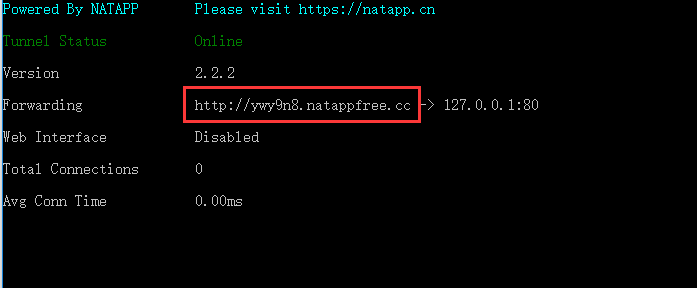

### JustAuth

[官方文档](https://www.justauth.cn/guide/quickstart/how-to-use/#%E4%BD%BF%E7%94%A8%E6%AD%A5%E9%AA%A4)

--- 
>系统中想要集成第三方登录，可以使用这个工具类库，简化第三方集成的过程。

#### 使用方式
- 引入依赖
```xml
<dependency>
    <groupId>me.zhyd.oauth</groupId>
    <artifactId>JustAuth</artifactId>
    <version>${latest.version}</version>
</dependency>
```
- 调用api
```java
// 创建授权request
AuthRequest authRequest = new AuthGiteeRequest(AuthConfig.builder()
    .clientId("clientId")
    .clientSecret("clientSecret")
    .redirectUri("redirectUri")
    .build());
// 生成授权页面
    authRequest.authorize("state");
// 授权登录后会返回code（auth_code（仅限支付宝））、state，1.8.0版本后，可以用AuthCallback类作为回调接口的参数
// 注：JustAuth默认保存state的时效为3分钟，3分钟内未使用则会自动清除过期的state
    authRequest.login(callback);
```
---
```txt
本地调试，推荐使用内网穿透工具NATAPP【https://natapp.cn】，将外网域名映射到本地，方便调试
。windows ,点击开始->运行->命令行提示符 后进入 natapp.exe的目录
。natapp -authtoken=9ab6b9040a624f40
。访问红框内的域名即可
```

