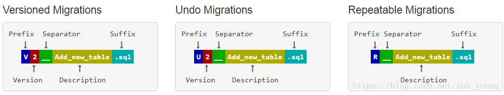

### flyway(数据库版本管理工具)

[官网地址](https://documentation.red-gate.com/flyway)

~~~
Flyway 是一款开源的数据库版本管理工具，用于管理和自动化数据库结构的变更。它可以跟踪和管理数据库的版本控制，并在应用程序启动时自动执行升级或回滚操作。

使用Flyway，你可以将数据库的变更以可重复且可控的方式应用到不同环境中，如开发、测试和生产环境。它支持多种数据库系统，包括MySQL、Oracle、PostgreSQL、SQL Server等。

Flyway将数据库结构的变更定义为一系列迁移脚本，通常是SQL脚本文件。每个迁移脚本都有一个唯一的版本号，Flyway会按照版本号的顺序依次执行这些脚本，以达到数据库结构的变更和更新。当应用程序启动时，Flyway会自动检测并执行未应用的迁移脚本，将数据库升级到最新版本。如果需要回滚到之前的版本，Flyway也提供了回滚操作的支持。

通过使用Flyway，开发团队可以更好地管理数据库结构的变更，保持不同环境之间的数据库一致性，并轻松地进行版本控制和追踪。
~~~

#### flyway的三种命名

- **V(Versioned Migrations)**:每个文件只会被执行一次
- **U(Undo Migrations)**: 与version作用相反，版本号与V一致
- **R(Repeatable Migrations)**:校验变化了就会执行
  

