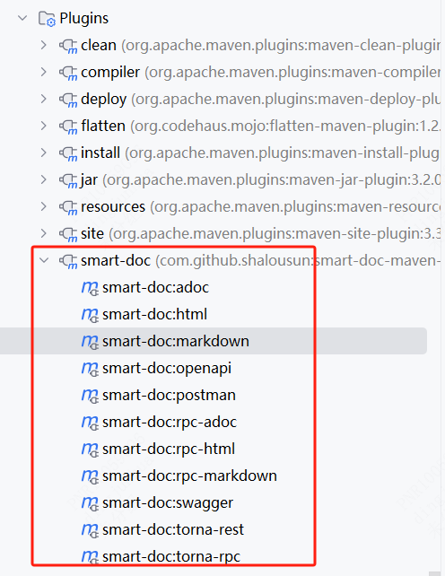

### smart-doc(基于源码注释接口文档)

[官网文档](https://smart-doc-group.github.io/zh/guide/what-is-smart-doc)

smart-doc[/smɑːt dɒk/]率先提出了基于Java泛型定义来推导接口文档的概念。它完全依赖于接口的源代码进行分析和生成文档，无需在业务代码中添加任何注解。 只需按照JavaDoc的标准编写注释，smart-doc就能够帮助您生成简洁明了的Markdown、HTML5、Postman Collection 2.0+ 和 OpenAPI 3.0+ 格式的文档。
